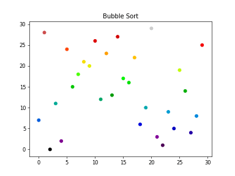
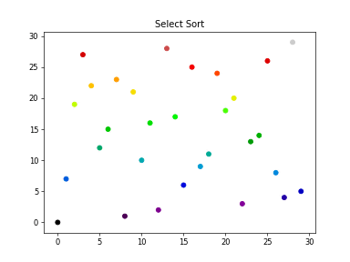

# Algorithms_animation
Scripts to visualize sorting algorithms using matplotlib animations
### Bar graph

### Scatter graph

## Algorithms available
- Bubble sort
- Quick sort
- Heap sort
- Select Sort

## About
The aim of this project is to make sorting algorithms easier to visualize and understand, using the animation capabilities of matplotlib.  

### Dependencies
- Python 3.6+
- Matplotlib
- Celluloid module(https://github.com/jwkvam/celluloid)
- Image magick to save as gif or ffmpeg to save as mp4

### Manual
- Install Matplotlib and Celluloid(if not already installed)
`pip install celluloid`
`pip install matplotlib`

- Install ImageMagick or ffmpeg(optional)

- Run main.py

`python main.py`

1. Select the algorithm
2. Select the type of graph
4. Choose if you want to save

